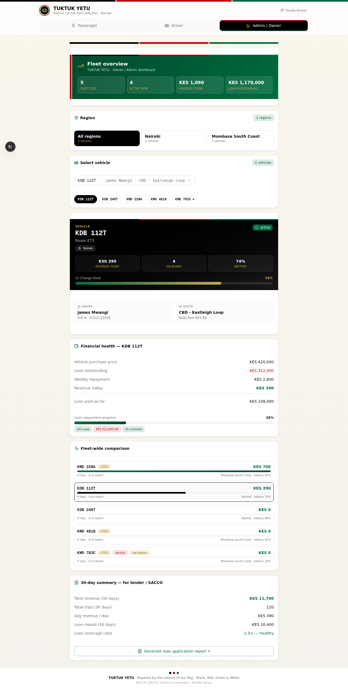

# 🇰🇪 TUKTUK YETU

**Kenya's hands-free fare collection platform for electric tuk tuks.**

Passengers pick their stage and pay via M-Pesa themselves — drivers focus on driving, not negotiating fares or chasing cash confirmations.



---

## 🎯 The Problem We Solve

Today in Kenya, tuk tuk drivers must:
- Negotiate fares with every passenger (often in traffic)
- Confirm cash payments manually before alighting
- Remember who paid what and where they're getting off
- Reconcile at the end of the day with the SACCO / vehicle owner

Passengers must:
- Know the local paybill / till number
- Wait for the driver to confirm payment before alighting
- Hope the driver remembers their destination stage

**TUKTUK YETU removes all of this.** The passenger picks their stage from a list and pays via M-Pesa STK push — the driver gets an automatic notification, hands-free.

---

## ✨ Features

### 👤 Passenger (self-service, no app needed)
- Enter the tuk tuk's plate number (or scan QR code in production)
- See all stages on the route with their fares
- **Landmark stages supported** — informal stops the driver knows by name (e.g. "Mama Otieno Kiosk", "Pungu Villa - New York")
- Pick destination → fare auto-quoted → pay via M-Pesa / QR / NFC / Cash
- Get an M-Pesa reference and payment confirmation instantly

### 🚗 Driver (focus on driving, not fare collection)
- Sign in with plate number + PIN
- Live passenger manifest auto-sorted by stage order
- Auto-notified the moment a passenger pays via M-Pesa/NFC/QR
- Cash passengers pop up in a "Confirm cash" card — just tap "Got cash" once money is received
- Battery & range indicator for electric tuk tuks
- "Alighted" button to mark when a passenger reaches their stage
- Live revenue & trip counter

### 📊 Admin / Owner (fleet management)
- **Region selector** — switch between operating regions (Nairobi, Mombasa South Coast, ...)
- **Per-vehicle switcher** — dropdown + quick chips for every tuk tuk in the fleet
- Financial health per vehicle: purchase price, loan outstanding, weekly repayment, revenue
- Loan repayment progress bar with on-schedule / behind-schedule badges
- Fleet-wide revenue comparison bar chart
- Service alerts for low battery / vehicles in service
- 30-day lender summary for SACCO / loan applications
- SACCO info card (e.g. Likoni TukTuk Owners & Drivers SACCO - LITOD)

---

## 🌍 Regions & Routes Currently Supported

### Nairobi
- **CBD – Eastleigh Loop** (8 stages, base fare KES 80) — incl. landmark stages like "Mama Otieno Kiosk" and "After Blue House"
- **Eastleigh – Pangani Loop** (5 stages, base fare KES 60)

### Mombasa South Coast — Likoni TukTuk Association (LITOD)
- **Ferry – South Coast Run** (23 stages, base fare KES 30) — full Likoni TukTuk Association price list:
  - Sinai KES 30 · Shelly Beach KES 30 · Kona Mpya KES 40 · Mtongwe KES 40 · Pungu Villa-New York KES 40 · Ujamaa-Fire KES 40 · Shikaadabu KES 50 · H-London-Jara-Gambani KES 50 · Ngombeni-Denyenye KES 60 · Maganya-Kombani KES 70 · Jara-Unik KES 70 · Tiwi KES 100 · **Ukunda KES 150** · Mwabungo KES 200 · Kinondo-Gasi KES 250 · **Msambweni KES 300** · Kona ya Shimoni KES 400 · SGR/Airport Ringgo KES 250/300/500
- **Kombani – Inland Run** (5 stages, base fare KES 70) — Kwale, Vunga, Simba, Patanani

---

## 🎨 Design

Themed in the **Kenyan flag colours** throughout:
- ⚫ Black `#000000`
- 🔴 Red `#BB0000`
- 🟢 Green `#006B3F`
- ⚪ White
- 🟡 Maasai shield gold `#C8A951` (accent)

The Kenyan flag stripe appears at the top of every interface. Driver dashboard hero uses a black gradient with a tri-color top accent. Owner dashboard uses a green gradient with a red+white spine mirroring the flag's vertical accent.

---

## 🛠 Tech Stack

- **Framework:** Next.js 16 (App Router) + TypeScript
- **Styling:** Tailwind CSS 4 + shadcn/ui (New York style) + Lucide icons
- **Database:** Prisma ORM + SQLite
- **State:** React hooks + polling (TanStack Query available)
- **Fonts:** Geist Sans / Mono
- **Theme:** Custom Kenyan flag palette in `globals.css`

---

## 🚀 Getting Started

### Prerequisites

- Node.js 18+ or Bun
- A SQLite installation (bundled with Prisma)

### Installation

```bash
# Clone the repo
git clone https://github.com/demitriosojwang/TUKTUK_YETU.git
cd TUKTUK_YETU

# Install dependencies
bun install   # or npm install

# Set up environment
cp .env.example .env
# Edit .env to set your DATABASE_URL

# Push the database schema
bun run db:push

# Seed the database with demo data
bun run scripts/seed.ts

# Start the dev server
bun run dev
```

Open [http://localhost:3000](http://localhost:3000) to see the app.

### Demo Credentials

**Drivers (plate + PIN):**
| Region | Plate | Driver | PIN |
|---|---|---|---|
| Nairobi | KDB 112T | James Mwangi | 1122 |
| Nairobi | KDB 246T | Aisha Wanjiru | 2233 |
| Mombasa | KMD 220A | Ervin Mmaitsi (LITOD) | 4455 |
| Mombasa | KMD 481B | Dennis Njeru (LITOD) | 5566 |
| Mombasa | KMD 703C | Salim Abdalla (LITOD) | 6677 |

**Passenger flow:** Just enter any of the plates above (e.g. `KDB 112T` or `KMD 220A`) and pick a stage.

---

## 📁 Project Structure

```
.
├── prisma/
│   └── schema.prisma           # Vehicle, Driver, Region, Sacco, Route, Stage, Trip, PassengerTrip
├── scripts/
│   └── seed.ts                 # Demo data: 2 regions, 5 vehicles, 4 routes, 36 stages
├── src/
│   ├── app/
│   │   ├── api/tuktuk-yetu/    # REST API endpoints
│   │   │   ├── fleet/          # GET /api/tuktuk-yetu/fleet
│   │   │   ├── vehicle/        # GET + PATCH /api/tuktuk-yetu/vehicle
│   │   │   ├── passenger/      # GET + POST /api/tuktuk-yetu/passenger
│   │   │   ├── passenger/action/  # POST alight / confirmCash
│   │   │   └── stats/          # GET /api/tuktuk-yetu/stats
│   │   ├── globals.css         # Kenyan flag theme tokens
│   │   ├── layout.tsx
│   │   └── page.tsx            # Main page with role switcher
│   ├── components/
│   │   ├── tuktuk-yetu/
│   │   │   ├── shared.tsx      # KenyaFlagStripe, usePoll hook, helpers
│   │   │   ├── PassengerView.tsx
│   │   │   ├── DriverView.tsx
│   │   │   └── OwnerView.tsx
│   │   └── ui/                 # shadcn/ui components
│   └── lib/
│       └── db.ts               # Prisma client
└── .env.example
```

---

## 🔌 API Reference

| Method | Endpoint | Description |
|---|---|---|
| `GET` | `/api/tuktuk-yetu/fleet` | All vehicles grouped by region, with driver/route/revenue |
| `GET` | `/api/tuktuk-yetu/vehicle?plate=KDB+112T` | Full vehicle detail with active trip & passengers |
| `PATCH` | `/api/tuktuk-yetu/vehicle` | Update battery % or status |
| `GET` | `/api/tuktuk-yetu/passenger?plate=KDB+112T` | Vehicle lookup for passenger booking |
| `POST` | `/api/tuktuk-yetu/passenger` | Passenger boards, picks stage, pays |
| `POST` | `/api/tuktuk-yetu/passenger/action` | Driver alights passenger or confirms cash |
| `GET` | `/api/tuktuk-yetu/stats` | Fleet-wide totals + per-vehicle + by-region breakdowns |

---

## 🔒 Production Notes

- The M-Pesa STK push is currently **simulated** — to go live, integrate the [Safaricom Daraja API](https://developer.safaricom.co.ke/) by filling in the MPESA_* env vars and replacing the simulation in `src/app/api/tuktuk-yetu/passenger/route.ts`.
- The driver PIN check is currently client-side only — add a real auth layer (NextAuth.js is already installed) before production.
- SQLite is fine for a single-instance demo; switch to PostgreSQL for production (update `prisma/schema.prisma` and `DATABASE_URL`).

---

## 🤝 Credits

- **Likoni TukTuk Owners & Drivers SACCO (LITOD)** — Mombasa South Coast price list
- Built for Kenyan SACCOs, drivers, and passengers

---

## 📜 License

MIT License — see [LICENSE](LICENSE) for details.

---

**Proudly Kenyan.** ⚫🔴🟢 Built with the colours of our flag.
